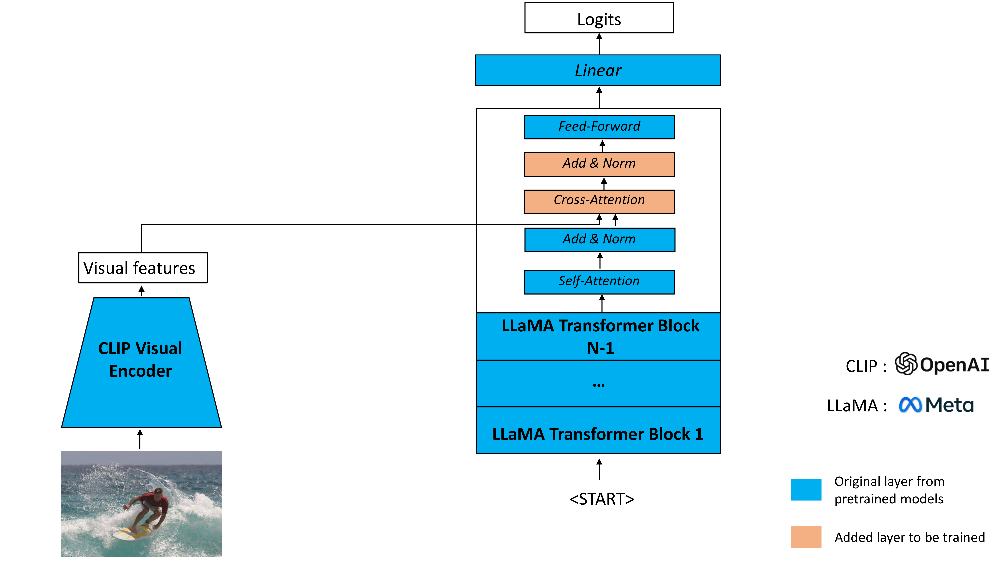

# Image Captioning 

This repository is an implementation of a captioning model using two pre-trained models the [CLIP](https://github.com/openai/CLIP) visual encoder and the
[LLaMA v1](https://github.com/facebookresearch/llama/tree/llama_v1) language model with 7B parameters.
In order to download the checkpoints and tokenizer of the LLaMA model, fill this [google form](https://forms.gle/jk851eBVbX1m5TAv5).


## Approach

The implemented project follows the framework displayed in the diagram bellow.




## Setup

In a conda env with pytorch / cuda available, run:
``` bash
$ pip install ftfy regex tqdm
$ pip install git+https://github.com/openai/CLIP.git
$ pip install -r requirements.txt
```
Then in this repository:
``` bash
$ pip install -e .
```

## Download of LLaMA checkpoints and tokenizer

Follow the instructions from [LLaMA official repository](https://github.com/facebookresearch/llama/tree/llama_v1) to download 
the checkpoints and tokenizer after being approved.
Please save these files in a '/download' folder.

## Download of the MSCOCO captions dataset
To train the captioning model, download the MSCOCO captions dataset, for example for the 2014 train split you can run
the following instructions.

In the folder you want to store the images of the dataset, run:
``` bash
wget http://images.cocodataset.org/zips/train2014.zip
unzip train2014.zip
rm train2014.zip
```

In the folder you want to store the annotations of the dataset, run:
```  bash
wget http://images.cocodataset.org/annotations/annotations_trainval2014.zip
unzip annotations_trainval2014.zip
rm annotations_trainval2014.zip
```

You can do the same with the 'val2014' split for inference purpose (the 'test2014' split doesn't have the annotations).

Finally, edit the path toward your images and annotations in `captioning_training.py` for the training dataset and in 
`captioning_inference.py` for the testing set.
##  Training
The provided `captioning_training.py` is the script allowing to fine-tune the captioning model on the number of epochs and with the number of added layers specified in the command line, as for example as presented bellow:

```
torchrun --nproc_per_node 1 captioning_training.py --epochs 5 --nb_ca 2 --loss_save_path res_files/loss_2ca_ep5.npy --model_path params_2ca_ep5.pt
```
## Inference

To generate the captions on the test split of the MSCOCO dataset with a fine-tuned captioning model you can use the `captioning_inference.py` script with specifying the path to the trained model, the path to the JSON output file and the temperature to use for inference. You can also specify a proportion of the testing split if you don't want to use all the images but only 10% for example as bellow:
```
torchrun --nproc_per_node 1 captioning_inference.py --model_path params_2ca_ep5.pt --nb_ca 2 --p_test 0.1 --temperature 0.0 --json_path res_files/eval_2ca_ep5_t0.0.json
```


## Reference

This fine-tuned captioning model uses two pre-trained models: the LLaMA language model and the CLIP visual encoder.


LLaMA: Open and Efficient Foundation Language Models -- https://arxiv.org/abs/2302.13971

```
@article{touvron2023llama,
  title={LLaMA: Open and Efficient Foundation Language Models},
  author={Touvron, Hugo and Lavril, Thibaut and Izacard, Gautier and Martinet, Xavier and Lachaux, Marie-Anne and Lacroix, Timoth{\'e}e and Rozi{\`e}re, Baptiste and Goyal, Naman and Hambro, Eric and Azhar, Faisal and Rodriguez, Aurelien and Joulin, Armand and Grave, Edouard and Lample, Guillaume},
  journal={arXiv preprint arXiv:2302.13971},
  year={2023}
}
```

CLIP : Learning Transferable Visual Models From Natural Language Supervision -- https://arxiv.org/abs/2103.00020
```
@article{DBLP:journals/corr/abs-2103-00020,
  author       = {Alec Radford and
                  Jong Wook Kim and
                  Chris Hallacy and
                  Aditya Ramesh and
                  Gabriel Goh and
                  Sandhini Agarwal and
                  Girish Sastry and
                  Amanda Askell and
                  Pamela Mishkin and
                  Jack Clark and
                  Gretchen Krueger and
                  Ilya Sutskever},
  title        = {Learning Transferable Visual Models From Natural Language Supervision},
  journal      = {CoRR},
  volume       = {abs/2103.00020},
  year         = {2021},
  url          = {https://arxiv.org/abs/2103.00020},
  eprinttype    = {arXiv},
  eprint       = {2103.00020},
  timestamp    = {Thu, 04 Mar 2021 17:00:40 +0100},
  biburl       = {https://dblp.org/rec/journals/corr/abs-2103-00020.bib},
  bibsource    = {dblp computer science bibliography, https://dblp.org}
}
```

## License
License of the LLaMA model: see the [LICENSE](LICENSE) file.
